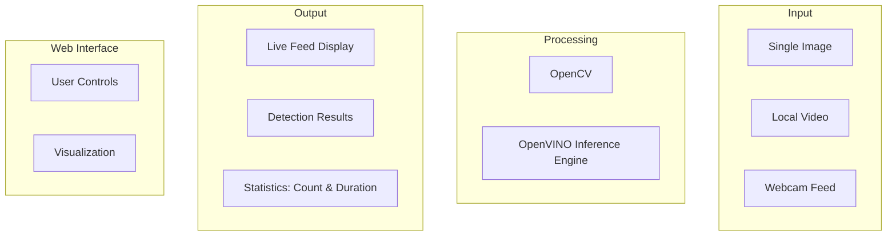
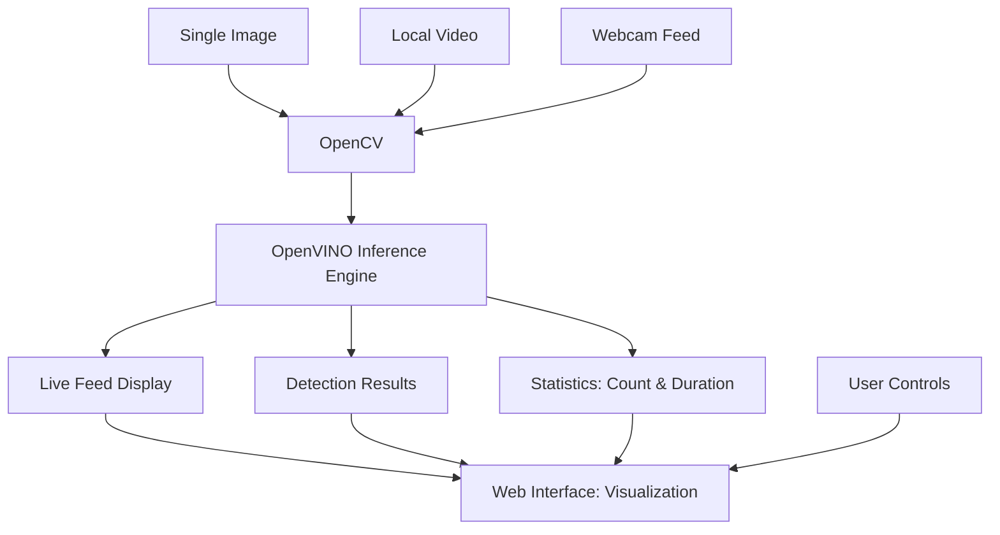

### 🧠 Architecture Explanation

#### 🔹 Input  
The application accepts various input sources:
- Single images  
- Local video files  
- Webcam feeds  

---

#### 🔹 Processing  
Frames from the input sources are:
- Processed using **OpenCV**  
- Analyzed with the **OpenVINO Inference Engine** for **person detection**  

---

#### 🔹 Output  
The output includes:
- **Live feed display**  
- **Detection results**  
- **Statistics**, such as:
  - Count of people in the frame  
  - Duration each person stays  

---

#### 🔹 Web Interface  
Users interact via a web interface that provides:
- **User controls**
- **Visualization of detection results**  

---

✅ This architecture enables **real-time people counting** with a clean, interactive interface and insightful visual feedback.
