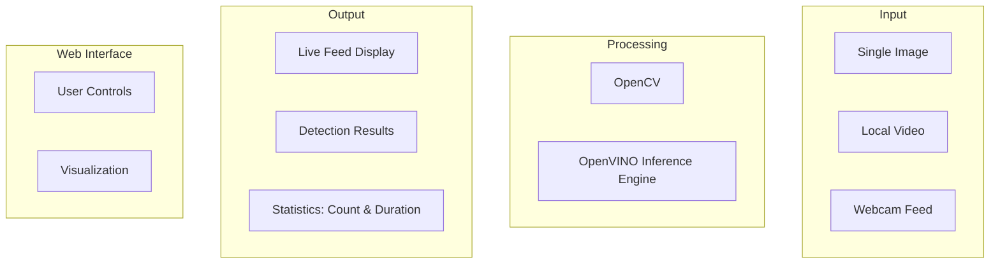

```mermaid
    A1 -->|Input| B1
    A2 -->|Input| B1
    A3 -->|Input| B1
    B1 -->|Frame Processing| B2
    B2 -->|Inference Results| C1
    B2 -->|Inference Results| C2
    B2 -->|Inference Results| C3
    C1 -->|Display| D2
    C2 -->|Display| D2
    C3 -->|Display| D2
    D1 -->|User Interaction| D2
```
