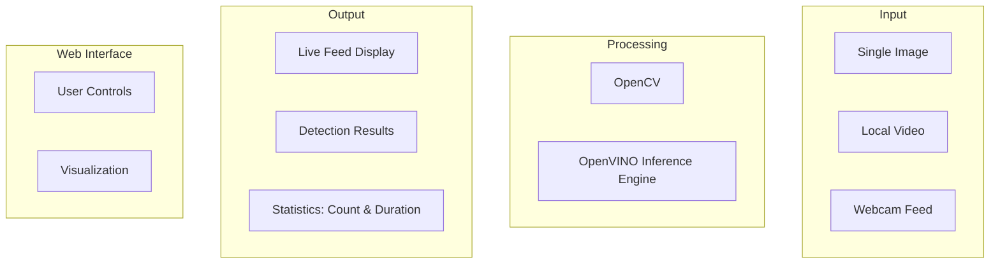
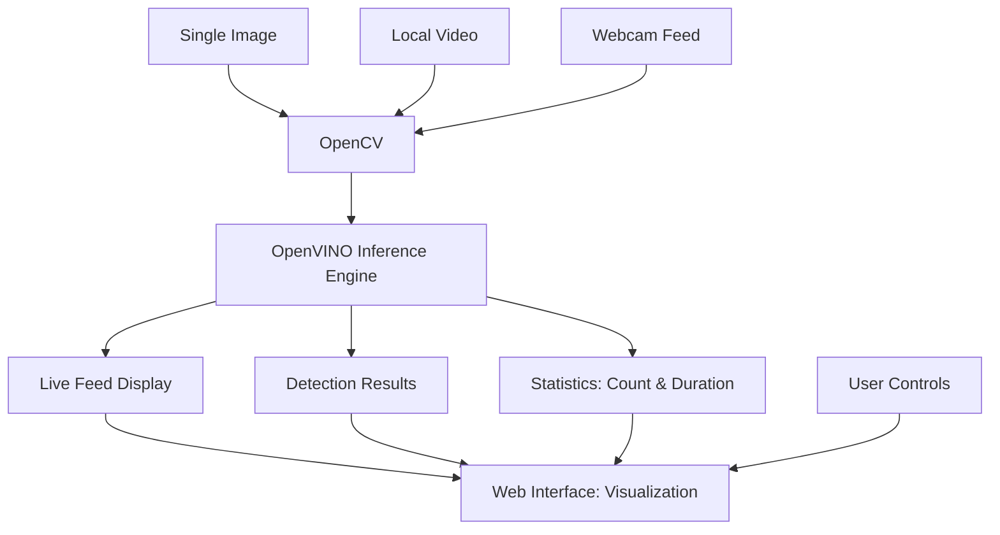

```mermaid
graph TD
    subgraph Input
        A1[Single Image]
        A2[Local Video]
        A3[Webcam Feed]
    end

    subgraph Processing
        B1[OpenCV]
        B2[OpenVINO Inference Engine]
    end

    subgraph Output
        C1[Live Feed Display]
        C2[Detection Results]
        C3[Statistics: Count & Duration]
    end

    subgraph Web Interface
        D1[User Controls]
        D2[Visualization]
    end
```

```mermaid
graph TD
    A1[Single Image] --> B1[OpenCV]
    A2[Local Video] --> B1
    A3[Webcam Feed] --> B1
    B1 --> B2[OpenVINO Inference Engine]
    B2 --> C1[Live Feed Display]
    B2 --> C2[Detection Results]
    B2 --> C3[Statistics: Count & Duration]
    C1 --> D2[Web Interface: Visualization]
    C2 --> D2
    C3 --> D2
    D1[User Controls] --> D2
```
