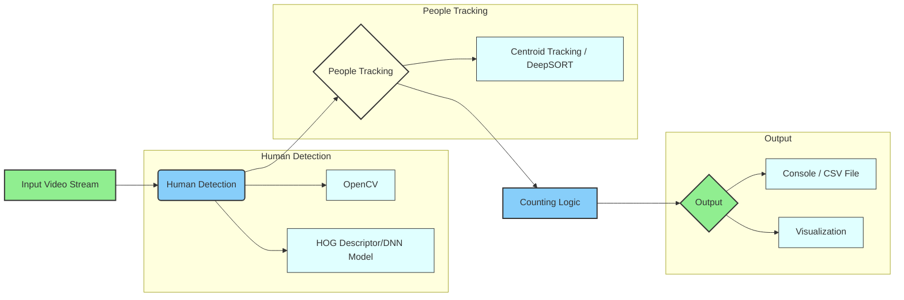

Main Process

Initialize the IE Plugin: The system begins by initializing the Inference Engine (IE) Plugin for the target device. This plugin is essential for running the model inference.
Load IR to the Plugin: The Intermediate Representation (IR) of the trained model is loaded into the IE Plugin. The IR is a model representation optimized for inference.
Capture Frames from the Input: The system captures frames from the input source, which could be a camera or a video file.
Execute the SSD Model: The Single Shot MultiBox Detector (SSD) model is executed on each frame to detect people present in the frame.
Draw Bounding Boxes: Bounding boxes are drawn around the detected people in the frame to visually mark the detection.
Calculate People Count and Duration: The system calculates the people count in the current frame, the total people count, and the duration each person is present in the frame.
Communication with Mosca Server

The system subscribes to people count in the current frame, total people count, and person duration and sends this information to the Mosca Server.
Communication with UI

FFmpeg: Every frame from the input is sent to the User Interface (UI) via FFmpeg, likely for real-time video display.
UI: The UI displays the output on a web interface. This includes the video feed and the people count information received from the Mosca Server.

# Outlining the Process of the AI People Counter

## Main Process:

* **Initialize the IE Plugin for the target device:** Wubba lubba dub dub! The main program kicks things off by initializing the Inference Engine (IE) plugin. This plugin, it's specific, you know, to the hardware (target device) where the AI model will be executed.
* **Load IR to the plugin:** Then, an Intermediate Representation (IR) of the trained Single Shot Detector (SSD) model is loaded into the initialized IE plugin. This IR, Morty, is an optimized format of the model for efficient inference.
* **Capture frames from the input:** Next, the system starts capturing frames from the input video source (e.g., a camera or a video file).
* **Execute the SSD model to detect people in the frame:** For each captured frame, Rick, the loaded SSD model is executed using the IE plugin. This process identifies the presence and location of people within the frame, outputting bounding box coordinates for each detected person.
* **Draw bounding boxes around the people detected:** Based on the output of the SSD model, bounding boxes are drawn around each detected person in the current frame. This visually highlights the detected individuals, Morty.
* **Calculate people count in current frame, total people count, and person duration:** The system calculates:
    * **People count in the current frame:** The number of bounding boxes detected in the current frame gives the instantaneous count of people.
    * **Total people count:** This likely involves tracking unique individuals across multiple frames to provide a cumulative count of people who have been detected.
    * **Person duration:** The system might track how long each individual remains within the frame or the field of view.

## Communication with other components:

* **Send people count and related data to Mosca Server:** The calculated "people count in current frame," "total people count," and "person duration" are sent to a Mosca Server.
* **Mosca Server subscribes and forwards to UI:** The Mosca Server is configured to subscribe to these data points. Upon receiving them, it forwards this information to the User Interface (UI).
* **Send every frame to the UI (via FFmpeg):** Simultaneously or in parallel, every captured frame (potentially with the drawn bounding boxes) is sent to the UI using FFmpeg. FFmpeg is likely used here to handle the video streaming and encoding for web display.

## User Interface (UI):

* **Displays the output on a web interface:** The UI receives the processed data (people counts, duration) from the Mosca Server and the video frames from FFmpeg. It then displays this information on a web interface, providing a visual representation of the people counting process. This would likely include the live video feed with bounding boxes and the calculated statistics.

In summary, Morty, the system captures video, uses an AI model to detect people, tracks and counts them, and then presents this information in real-time on a web interface. The Mosca Server acts as a message broker for the numerical data, while FFmpeg handles the streaming of the video frames.

