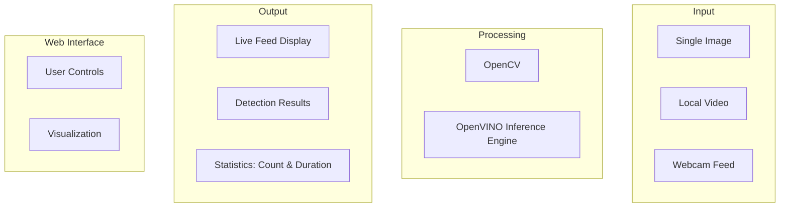

    %% Flow connectors (for vertical alignment)
    A1 --> B1
    A2 --> B1
    A3 --> B1
    B1 --> B2
    B2 --> C1
    B2 --> C2
    B2 --> C3
    C1 --> D2
    C2 --> D2
    C3 --> D2
    D1 --> D2
