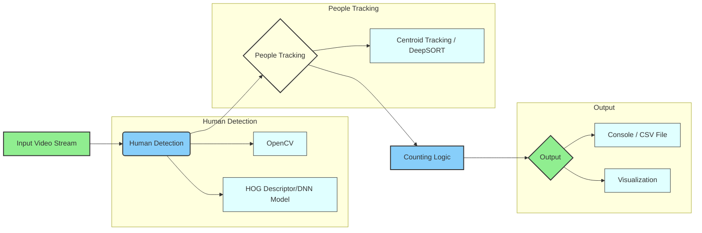

Main Process

Initialize the IE Plugin: The system begins by initializing the Inference Engine (IE) Plugin for the target device. This plugin is essential for running the model inference.
Load IR to the Plugin: The Intermediate Representation (IR) of the trained model is loaded into the IE Plugin. The IR is a model representation optimized for inference.
Capture Frames from the Input: The system captures frames from the input source, which could be a camera or a video file.
Execute the SSD Model: The Single Shot MultiBox Detector (SSD) model is executed on each frame to detect people present in the frame.
Draw Bounding Boxes: Bounding boxes are drawn around the detected people in the frame to visually mark the detection.
Calculate People Count and Duration: The system calculates the people count in the current frame, the total people count, and the duration each person is present in the frame.
Communication with Mosca Server

The system subscribes to people count in the current frame, total people count, and person duration and sends this information to the Mosca Server.
Communication with UI

FFmpeg: Every frame from the input is sent to the User Interface (UI) via FFmpeg, likely for real-time video display.
UI: The UI displays the output on a web interface. This includes the video feed and the people count information received from the Mosca Server.


```mermaid
graph LR
    A[Input Video Stream] --> B(Human Detection);
    B --> C{People Tracking};
    C --> D[Counting Logic];
    D --> E{Output};

    subgraph Human Detection
        B1[OpenCV];
        B2[HOG Descriptor/DNN Model];
        B --> B1;
        B --> B2;
    end

    subgraph People Tracking
        C1[Centroid Tracking / DeepSORT];
        C --> C1;
    end

    subgraph Output
        E1[Console / CSV File];
        E2[Visualization];
        E --> E1;
        E --> E2;
    end

    style A fill:#90EE90,stroke:#333,stroke-width:2px
    style B fill:#87CEFA,stroke:#333,stroke-width:2px
    style C fill:#FFFFE0,stroke:#333,stroke-width:2px
    style D fill:#87CEFA,stroke:#333,stroke-width:2px
    style E fill:#90EE90,stroke:#333,stroke-width:2px
    style B1 fill:#E0FFFF,stroke:#333,stroke-width:1px
    style B2 fill:#E0FFFF,stroke:#333,stroke-width:1px
    style C1 fill:#E0FFFF,stroke:#333,stroke-width:1px
    style E1 fill:#E0FFFF,stroke:#333,stroke-width:1px
    style E2 fill:#E0FFFF,stroke:#333,stroke-width:1px ```
