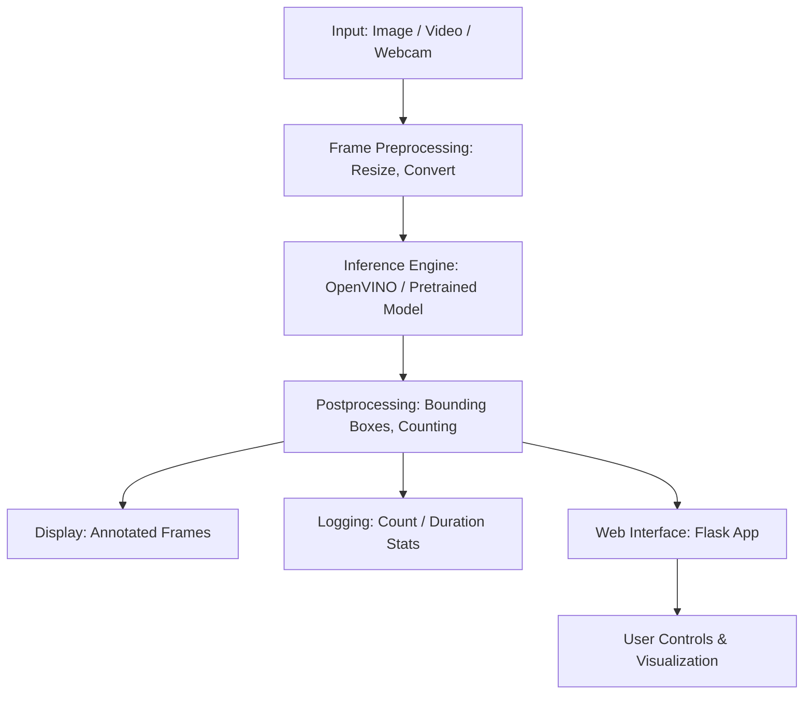

# 👁️‍🗨️ AI People Counter - Python & OpenVINO

A real-time people detection and counting app using OpenCV + OpenVINO. It supports image, video, and webcam feeds and displays live results through a web interface.

---

## 🧠 Architecture Diagram



---

## 🔄 Workflow Explanation

### 1. 🖼️ Input Sources
- Accepts:
  - Single Image
  - Local Video File
  - Webcam Feed

### 2. ⚙️ Frame Processing
- Resizing and color conversion with OpenCV
- Preparing for inference input

### 3. 🧠 Inference
- Model used: `person-detection-retail-0013` (OpenVINO)
- Runs detection and outputs bounding boxes + confidence

### 4. 🧮 Postprocessing
- Draws boxes
- Tracks presence duration
- Counts total number of persons

### 5. 🖥️ Output
- Real-time annotated frames shown via `cv2.imshow`
- Console/statistical logging

### 6. 🌐 Web Interface
- Flask-based dashboard
- Shows visual results and interactive controls

---

## 🚀 Step-by-Step Execution

### 📦 1. Clone the Repository

```bash
git clone https://github.com/immehulsolanki/ai-people-couter-python.git
cd ai-people-couter-python
```

---

### 🧠 2. Download & Prepare Model

#### Option A: Intel Pretrained Model

Download:
👉 [person-detection-retail-0013](https://docs.openvino.ai/latest/omz_models_model_person_detection_retail_0013.html)

Or use downloader:

```bash
/opt/intel/openvino/deployment_tools/tools/model_downloader/downloader.py --name person-detection-retail-0013
```

#### Option B: TensorFlow → IR Conversion

Example:

```bash
python mo.py --input_model frozen_inference_graph.pb --tensorflow_use_custom_operations_config ssd_v2_support.json --input_shape [1,300,300,3] --reverse_input_channels
```

---

### 🔧 3. Install Dependencies

```bash
pip install -r requirements.txt
```

If needed:

```bash
pip install opencv-python openvino
```

---

### 📁 4. Prepare Input Source

Place your:
- Video/Image in `./resources/`
- Use `cam` for live webcam

---

### ▶️ 5. Run the App

```bash
python inference_local.py -m path_to_model.xml -i input_source -d CPU
```

Example:

```bash
python inference_local.py -m ./models/person-detection-retail-0013.xml -i ./resources/video.mp4 -d CPU
```

Arguments:
- `-m`: Path to model XML
- `-i`: Input (file or `cam`)
- `-d`: Device (CPU, GPU, etc.)

---

### 📊 6. Output & Stats

- Live video with bounding boxes
- Person count & dwell time per frame
- Optional stats output to CSV

---

### ⚙️ 7. Tune Parameters (Optional)

Adjust in `inference_local.py`:
- FPS
- Confidence threshold
- Inference delay

---

## 📌 Notes

- Based on OpenVINO and Intel Model Zoo
- Use `WRITEUP.md` for deeper performance comparisons
- Make sure to install OpenVINO and source environment variables properly

---

## 📎 Resources

- 🔗 [Project Repo](https://github.com/immehulsolanki/ai-people-couter-python)
- 📄 [Architecture Diagram](https://github.com/immehulsolanki/ai-people-couter-python/blob/master/resources/images/arch_diagram.png)
- 📃 [WRITEUP.md - Analysis & Models](https://github.com/immehulsolanki/ai-people-couter-python/blob/master/WRITEUP.md)

---
